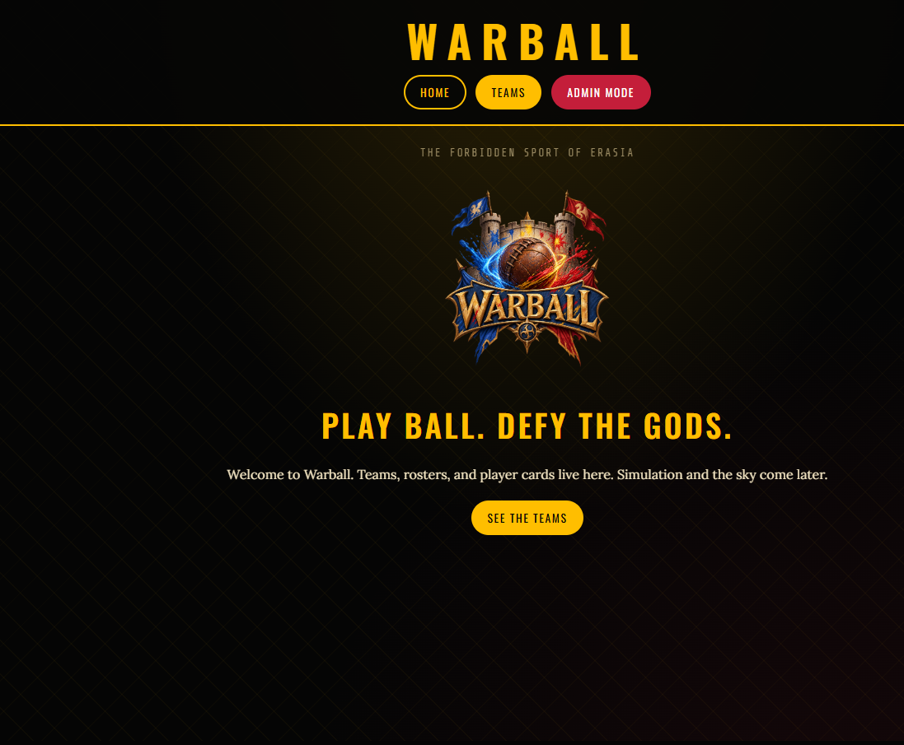
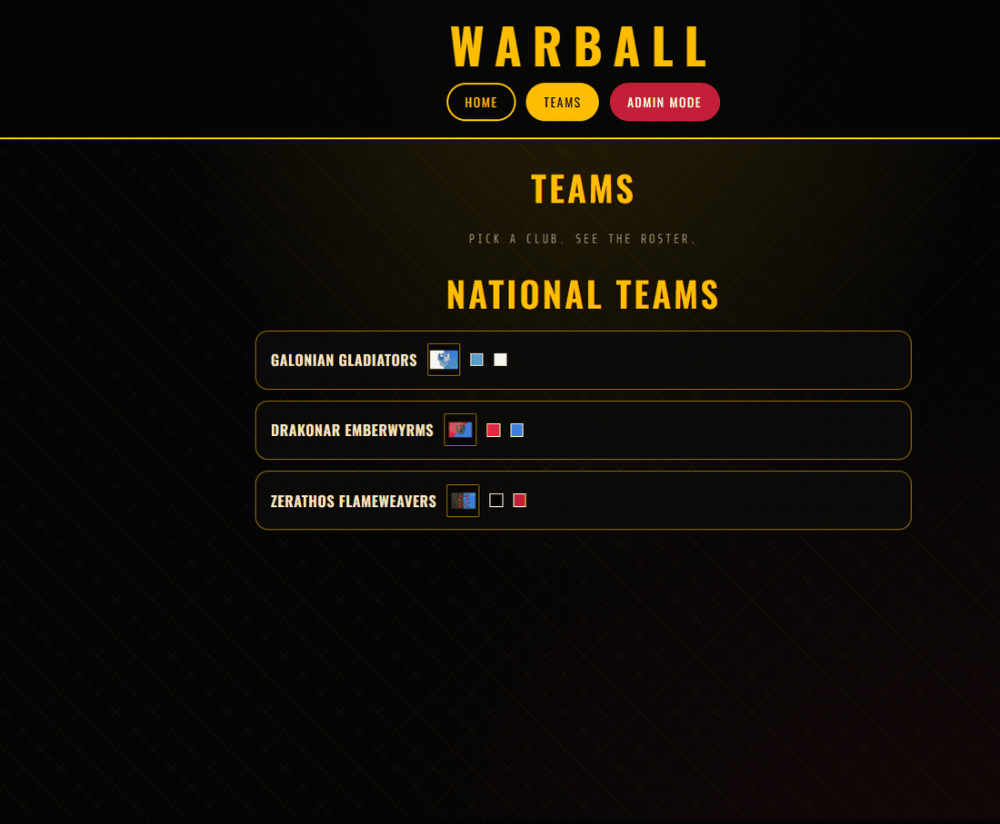
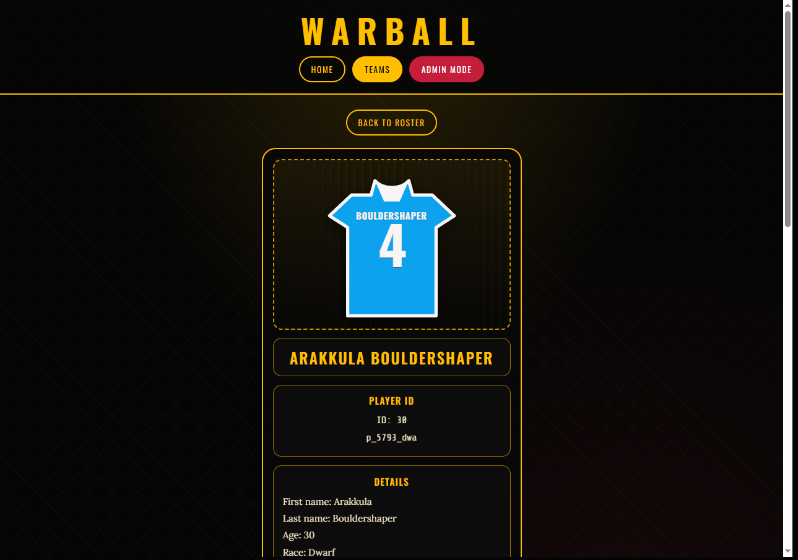

# Project Warball


## Overview

Project Warball is an automated, browser-based text sports simulation game. Inspired by [Blaseball](https://www.blaseball.com), it translates a fictional sport played in Earisia into a live web dashboard. Matches will eventually require no direct input: the backend will calculate passes, tackles, and shots and broadcast them to the client.

**What you can do today:** browse national teams (with flags and kit colors), open a roster, open a player card with an FM-style kit, and — from Admin Mode — create/edit teams and players or **generate** a random player from JSON catalogs.

Design and lore: `warball_documentation.md`. Engineering deep-dive (every entity, method, and why): [`docs/TECHNICAL.md`](docs/TECHNICAL.md).



## Current product surface

### Public


- **Home** — logo, tagline, link into the directory.
- **Teams** — national clubs, country flags, home-kit color swatches.
- **Roster** — shirt number, name, position.
- **Player details** — kit SVG (team hexes + name/number), identity, hobbies, dice attributes (−3.0–3.0 on new generates), traits still empty until generate is wired.

Teams → roster:



Roster → player card:





### Admin (“Commissioner’s office”)


- Team list, create/edit (name, country, province, four kit hexes).
- Per-team roster with **Add player**, **Generate player**, and **Edit player**.
- Player form edits scalars (names, race, age, position, hobbies as comma-separated text, shirt number) and **preserves** JSON attributes/traits on save.


## System architecture

Monorepo:

* **Frontend (`frontend/warball/`):** Angular 21 (standalone, zoneless), Tailwind CSS v4, `HttpClient` REST. Planned: SSE for live match feeds.
* **Backend (`backend/`):** Java 21, Spring Boot 3.x, executable JAR, REST under `/api/v1/`. Planned: `SimulationEngineService`.

### Database strategy

* **MySQL / MariaDB (`warball_db`, port 3307):** teams and players. JPA `ddl-auto=update`. Player attributes, traits, status effects, and hobbies are JSON columns.
* **MongoDB (`warball_live`):** reserved for live match state. Not used yet.

## API (`/api/v1`)

CORS origin: `http://localhost:4200`.

### Teams

| Method | Endpoint | Description |
|--------|----------|-------------|
| `GET` | `/teams` | List teams |
| `GET` | `/teams/{id}` | One team (404 if missing) |
| `POST` | `/teams` | Create (201) |
| `PUT` | `/teams/{id}` | Update (200 / 404) |
| `GET` | `/teams/{teamId}/players` | Roster |
| `POST` | `/teams/{teamId}/players/generate` | Procedural player (201) |

### Players

| Method | Endpoint | Description |
|--------|----------|-------------|
| `GET` | `/players/{id}` | One player, including nested team |
| `POST` | `/players` | Manual create (201) |
| `PUT` | `/players/{id}` | Update scalars + JSON (200 / 404) |

No DELETE endpoints. No `GET /players` (always scoped to a team).

Example team:

```json
{
  "id": 1,
  "teamName": "Galonian Gladiators",
  "country": "Galonian Empire",
  "province": null,
  "homePrimaryHex": "#0ca2ed",
  "homeSecondaryHex": "#f9f5f5",
  "awayPrimaryHex": "#050505",
  "awaySecondaryHex": "#0bb6ef"
}
```

## Player generator

`PlayerGeneratorService` loads catalogs from `backend/src/main/resources/generator/` at startup:

| File | Used for |
|------|----------|
| `races.json` | 10 races (`key` + display `label`) |
| `subraces.json` | Subrace labels per race key |
| `first-names.json` | Sexed first names + `generic` fallback |
| `last-names.json` | Surnames + `generic` fallback |
| `hobbies.json` | Global verbs × hobbies (flavor only) |
| `positions.json` | Castle Keeper, Defender, Attacker |
| `traits.json` | Blessings/curses with `traitId`, `name`, `type`, and `modifiers` |

Each generate rolls age 18–40, a free shirt number 1–99 (unique per team), and attribute dice **−3.0–3.0** (`roll()`: `nextInt(61) / 10.0 - 3.0`). Every generated stat goes through that one method.

Traits are **mechanical**, not flavor like hobbies: each catalog entry has a `modifiers` map (camelCase keys matching attribute fields, e.g. `heft`, `stickyFingers`). `Trait.java` already has `Map<String, Double> modifiers`. The generator field `traitCatalog` exists; **load / pick 1–2 / apply / clamp is not wired yet**, and `generateForTeam` still sets `traits` to `null`. Do not wipe the `players` table until generate applies traits and writes empty `statusEffects`.

## Version 1 — remaining

* Load `traits.json` in `loadCatalogs`, pick **1–2** traits per player (no duplicate `traitId` on the same player; same trait on different players is allowed)
* Apply modifiers to rolled attributes, then clamp to **[−3.0, 3.0]**
* Empty `statusEffects` list at create (`List.of()`, not `null`)
* Then optional purge of old player rows
* Live match feed (SSE) + MongoDB `warball_live`
* Auth on `/admin/*` before VPS
* Optional DELETE endpoints

## Local development

### Prerequisites

* Node.js & npm
* Java 21 & Maven
* MariaDB/MySQL on **3307** with database `warball_db` (see `backend/src/main/resources/application.properties`). On this machine that is XAMPP MySQL (`C:\xampp\mysql`), not MySQL80 on 3306.
* MongoDB 27017 — only required when live simulation lands

### Backend

```powershell
cd backend
.\mvnw.cmd spring-boot:run
```

Verify: `http://localhost:8080/api/v1/teams`

### Frontend

```powershell
cd frontend/warball
npm install
npx ng serve
```

Open `http://localhost:4200` (use **localhost**, not `127.0.0.1`, so CORS matches). If new files under `public/` 404, restart `ng serve`.

Frontend-specific notes and the same screenshots: [`frontend/warball/README.md`](frontend/warball/README.md).

### Packaging

The backend is an **executable JAR**, not a WAR. Deploy with `java -jar`.

## Project structure (now)

```text
warball/
├── backend/
│   └── src/main/java/com/warball/backend/
│       ├── controllers/     TeamRestController, PlayerRestController
│       ├── entities/        Team, Player
│       ├── embeddables/     attributes, Trait, StatusEffect
│       ├── repositories/    TeamRepository, PlayerRepository
│       └── services/        Team, Player, PlayerGeneratorService
├── frontend/warball/
│   └── src/app/
│       ├── components/      home, teams, roster, details, admin/*
│       ├── models/          Team, Player
│       ├── services/        team.ts, player.ts
│       └── utils/           country-flags.ts
├── docs/
│   ├── TECHNICAL.md
│   ├── images/
│   └── gifs/
└── README.md
```

---

*Project Warball is a passion project built to merge web development architecture with deep, narrative-driven tabletop lore.*
