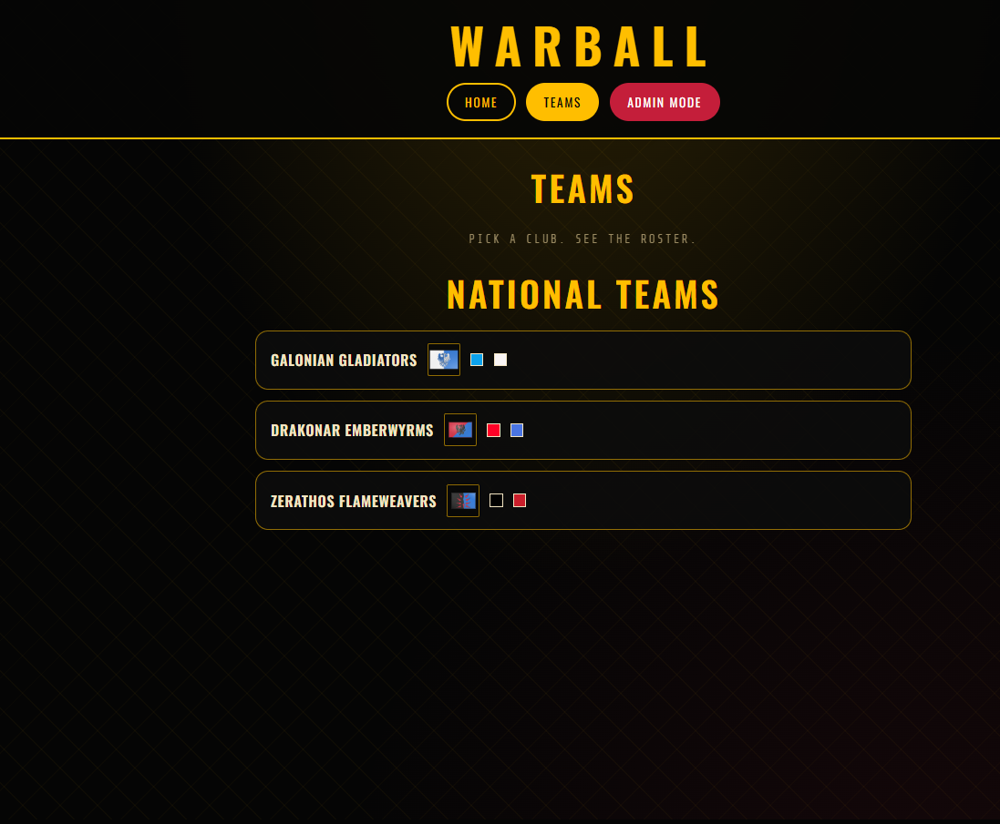
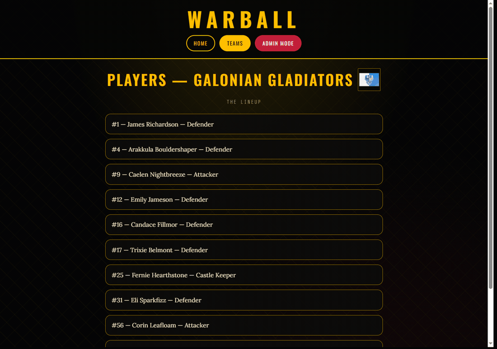
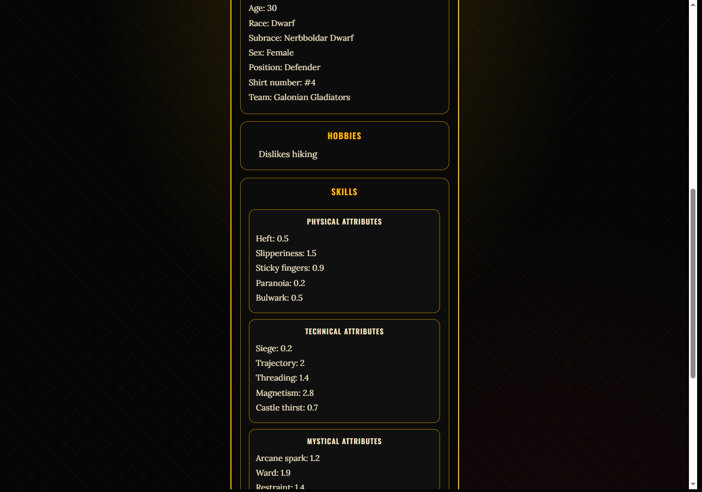
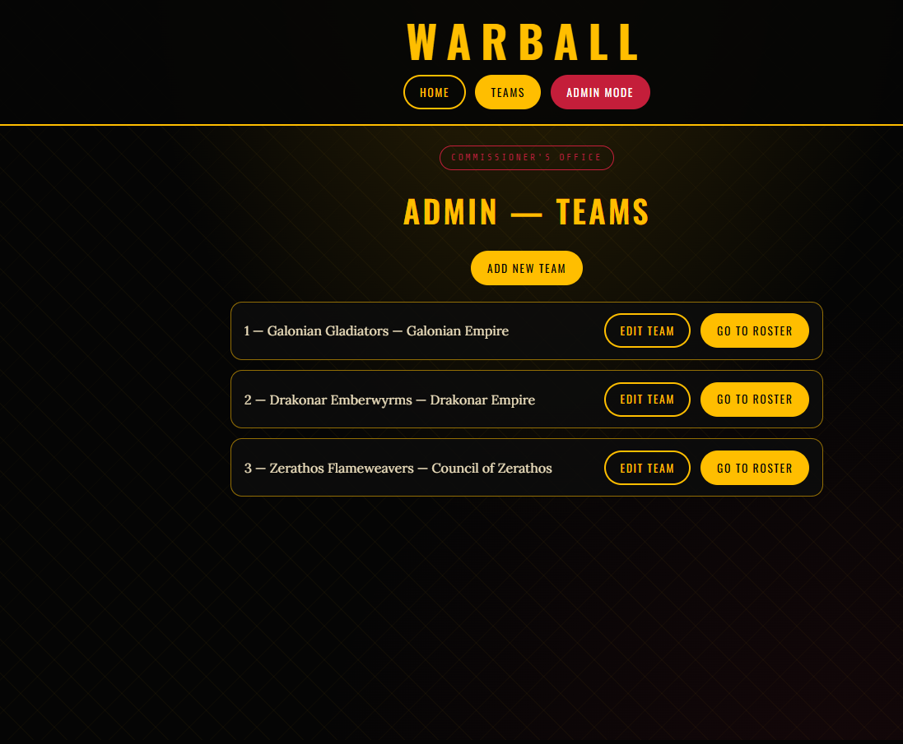
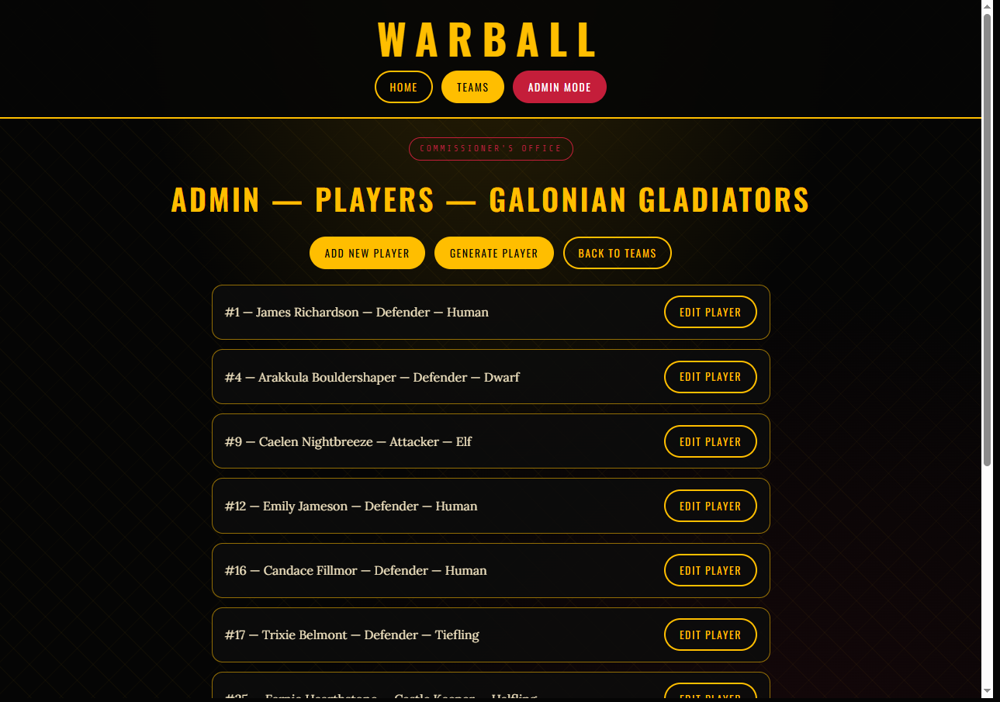
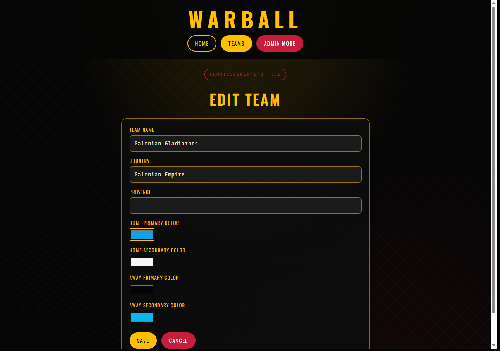
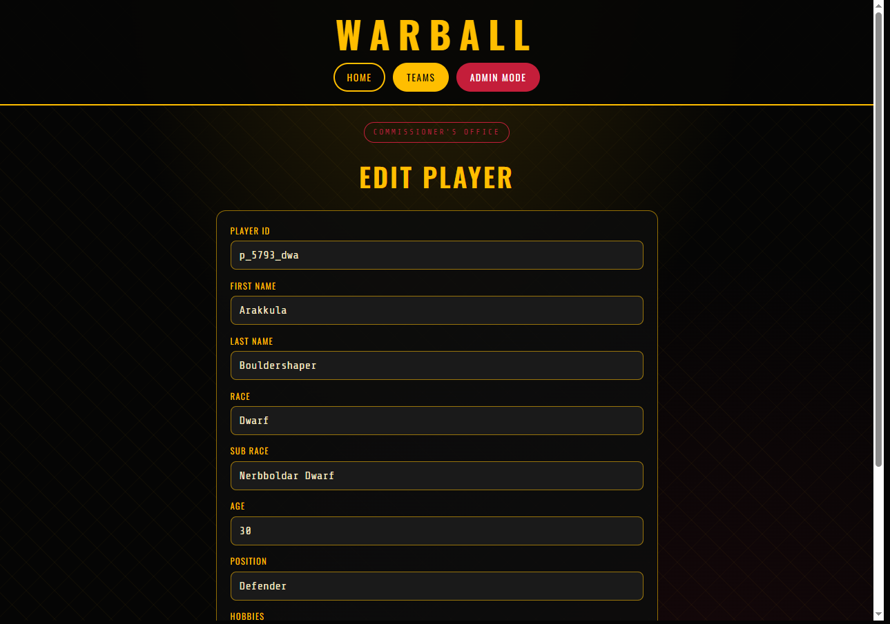

# Warball frontend

Angular 21 (standalone, zoneless) client for [Project Warball](../../README.md). It is the public directory and the commissioner’s admin UI. The Spring Boot API on `http://localhost:8080/api/v1` is the source of truth.

Engineering detail for both sides of the stack: [`docs/TECHNICAL.md`](../../docs/TECHNICAL.md).


## What this app does

| Area | Routes | Behavior |
|------|--------|----------|
| Home | `/` | Logo, tagline, enter the directory |
| Teams | `/teams` | National teams, flags, kit swatches |
| Roster | `/teams/:id/players` | Shirt, name, position |
| Player card | `/teams/:id/players/:playerId/details` | Kit SVG, details, hobbies, skills |
| Admin teams | `/admin/teams`, `.../new`, `.../:id/edit` | CRUD + kit hex colors |
| Admin roster | `/admin/teams/:id/players` | Manual add, **Generate player**, edit |

Admin is **not** authenticated yet (deferred until VPS).



National teams → club roster:


Roster → player details (kit + card):














## Stack

* Angular 21, standalone components, no NgModules
* `provideHttpClient()` in `app.config.ts`
* Tailwind CSS v4 (`@import 'tailwindcss'`) plus the `wb-*` theme in `src/styles.css` (Oswald / Lora / Share Tech Mono)
* Reactive Forms for admin create/edit
* `async` pipe + `@for` / `@if` control flow in templates

## How the UI talks to the API

| Service | File | Role |
|---------|------|------|
| `TeamService` | `src/app/services/team.ts` | `GET/POST/PUT` `/teams` |
| `PlayerService` | `src/app/services/player.ts` | Roster, one player, create/update, **generate** |

Models in `src/app/models/` mirror the Java entities (`Team`, `Player`, nested attribute interfaces). Create/update strip `id` from the JSON body so Hibernate owns the primary key.

Country flags: `src/app/utils/country-flags.ts` maps `Team.country` to files in `public/flags/`. Broken images are hidden via a `signal` so the template does not retry forever.

Player kit: inline SVG in `player-details.html`, colored with `--kit-primary` / `--kit-secondary` from the team’s home hexes, last name + number printed on the shirt.

## Development server

From this folder:

```bash
npm install
npx ng serve
```

Open [http://localhost:4200/](http://localhost:4200/). The API must already be running on port 8080, and the browser host must be **localhost** (not `127.0.0.1`) to match backend CORS.

If you add files under `public/` (logo, flags) and they 404, restart `ng serve` — the dev server does not always pick up new public paths.

```bash
ng build
```

Output goes to `dist/`. Production still needs an environment-specific API URL (currently hardcoded to localhost).

## Tests

```bash
ng test
```

Vitest is wired by the Angular CLI. E2E is not configured (`ng e2e` will not run a suite until one is added).

## Scaffolding

```bash
ng generate component component-name
ng generate --help
```

New public screens belong next to `home` / `team-list` / `player-list` / `player-details`. New commissioner screens belong under `components/admin/` and should keep the “Commissioner's office” banner.

## Layout of `src/app`

```text
src/app/
├── app.ts / app.html / app.routes.ts / app.config.ts
├── components/
│   ├── header/
│   ├── home/
│   ├── team-list/
│   ├── player-list/
│   ├── player-details/
│   └── admin/          team-list, team-form, player-list, player-form
├── models/team/  models/player/
├── services/     team.ts, player.ts
└── utils/        country-flags.ts
```

Static assets: `public/images/warball-logo.png`, `public/flags/*`.

## CLI reference

[Angular CLI overview](https://angular.dev/tools/cli).
